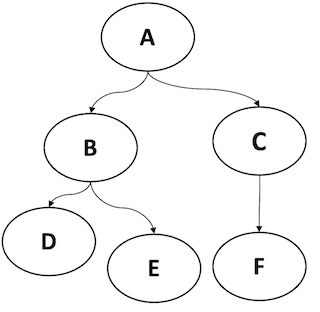

# pipeline

파이프라인은 단일 컨테이너 실행으로 정의되는 노드들이 하나 이상의 단계로 구성되어 있는 워크플로우입니다.
각 단계 또는 노드들은 입력 및 출력 매개변수를 통해 파이프라인의 흐름을 구성합니다.
파이프라인 작성자가 작업한 노드의 출력은 다른 노드의 입력으로 지정하여 작업의 계산 방향을 비순환 그래프를 형성할 수 있습니다.
기본적인 노드들을 활용해 여러 예제 그래프를 작성한 python 코드를 확인합니다.

## 디렉토리 구조

 -`DAG` 컴포넌트(노드)수에 따라 작성할 수 있는 파이프라인 예제 및 DAG 구조 확인
   - `node_2` 노드 개수 2개일 경우
   - `node_3` 노드 개수 3개일 경우
   - `node_4` 노드 개수 4개일 경우   
 -`Condition` 컴포넌트(노드)의 출력 상태에 따라 다른 워크플로우를 제공하는 파이프라인 예제
 -`test_example` 실제 딥러닝 프로젝트에서 사용하는 파이프라인 예제
   - `data_augmentation` 데이터 증강 파이프라인
   - `train_model` mnist 모델 학습 및 테스트 예제

## 코드 설명

* `pipeline_example.ipynb` 파이프라인을 구성하는 기본 노드(컴포넌트)들을 정의하는 방법을 확인할 수 있습니다.
* `DAG_example.ipynb` 파이프라인을 작성하기 위해 노드의 입력과 출력을 연결하는 방법을 다음 그림을 단계별로 구현하면서 확인할 수 있습니다.   
</img>   

### DAG_example 예제

`DAG_example.ipynb` 예제를 수행하였을 때 다음과 같은 yaml파일의 출력을 확인할 수 있습니다.   

다음 순서를 통해 그림의 DAG를 파이프라인 구현 예제를 설명합니다.   
파이프라인 구성의 가장 기본인 2개의 노드를 입력과 출력으로 연결하는 방법을 확인합니다.   
이후 노드 3개일 때 2개 이상의 입력과 출력 연결을 확인합니다.   
마지막으로 전체 DAG 구조의 파이프라인을 작성합니다.
1. `node2_example.yaml`
2. `node3_example.yaml`
3. `DAG_node_example.yaml`
